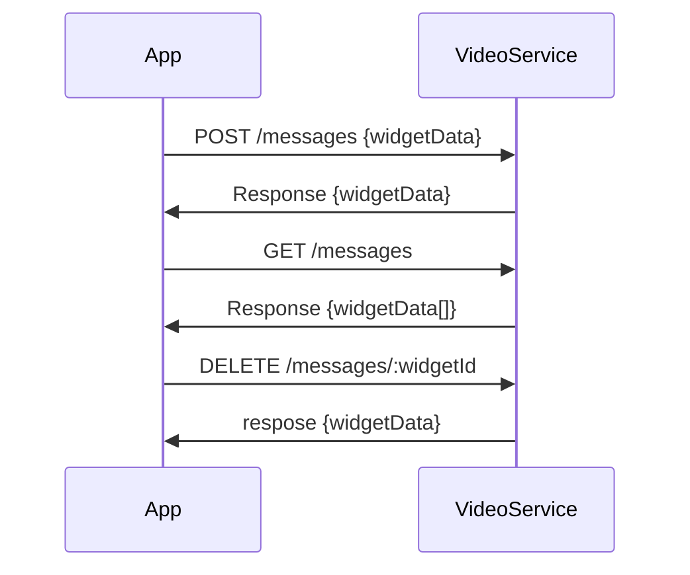

# Open widgets

```mermaid
sequenceDiagram
    participant App
    participant VideoService
    App ->> VideoService: POST /messages {widgetData}
    VideoService ->> App: Response {widgetData}
    App ->> VideoService: GET /messages
    VideoService ->> App: Response {widgetData[]}
    App ->> VideoService: DELETE /messages/:widgetId
    VideoService ->> App: respose {widgetData}
```