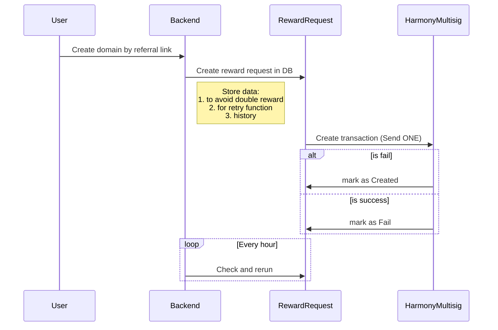

```mermaid

sequenceDiagram
    participant User
    participant Backend
    participant RewardRequest
    participant HarmonyMultisig
    User ->> Backend: Create domain by referral link
    Backend ->> RewardRequest: Create reward request in DB
    Note right of Backend: Store data:<br /> 1. to avoid double reward <br /> 2. for retry function <br /> 3. history
    RewardRequest ->> HarmonyMultisig: Create transaction (Send ONE)
    alt is fail
        HarmonyMultisig->>RewardRequest: mark as Created
    else is success
        HarmonyMultisig->>RewardRequest: mark as Fail
    end
    loop Every hour
        Backend ->> RewardRequest: Check and rerun
    end

```
