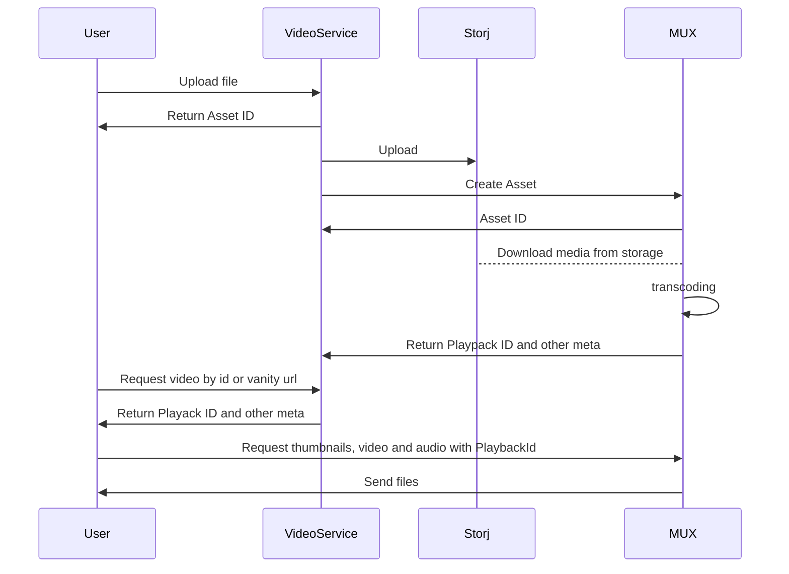

```mermaid
sequenceDiagram
    participant User
    participant VideoService
    participant Storj
    participant MUX
    User ->> VideoService: Upload file
    VideoService ->> User: Return Asset ID
    VideoService ->> Storj: Upload
    VideoService ->> MUX: Create Asset
    MUX ->> VideoService: Asset ID
    
    MUX --> Storj: Download media from storage
    MUX ->> MUX: transcoding
    MUX ->> VideoService: Return Playpack ID and other meta
    User ->> VideoService: Request video by id or vanity url
    VideoService ->> User: Return Playack ID and other meta
    User ->> MUX: Request thumbnails, video and audio with PlaybackId
    MUX ->> User: Send files
```

Storj role:
- store origin files
- mux grabs video file from Storj for transcoding
