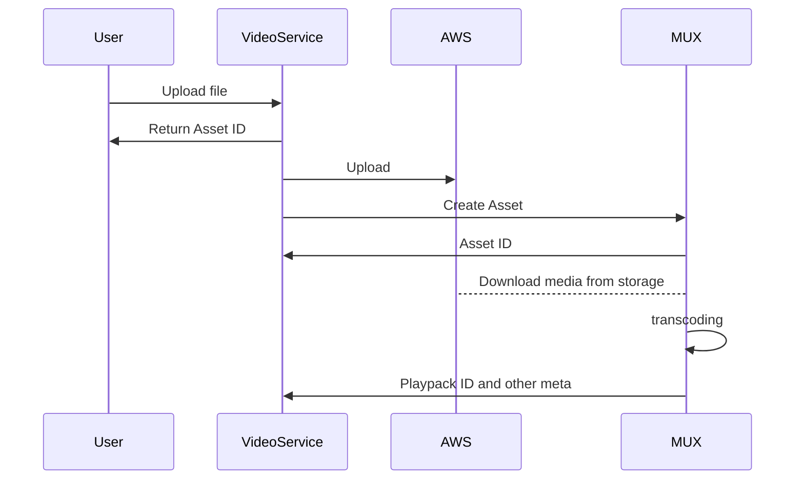

```mermaid
sequenceDiagram
    participant User
    participant VideoService
    participant AWS
    participant MUX
    User ->> VideoService: Upload file
    VideoService ->> User: Return Asset ID
    VideoService ->> AWS: Upload
    VideoService ->> MUX: Create Asset
    MUX ->> VideoService: Asset ID
    
    MUX --> AWS: Download media from storage
    MUX ->> MUX: transcoding
    MUX ->> VideoService: Playpack ID and other meta
```

AWS role:
- store origin files
- mux grabs video file from AWS for transcoding
