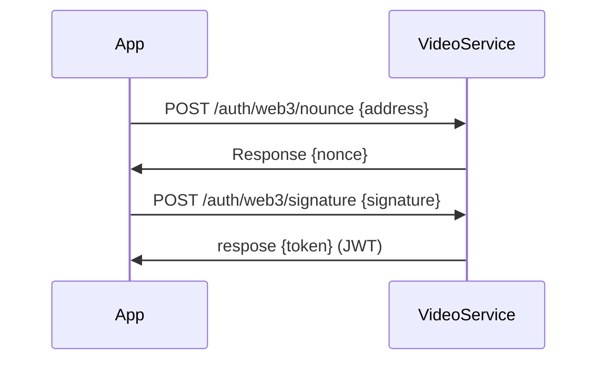

# Web3 auth



## Request nonce
```
curl 'http://localhost:8080/auth/web3/nonce' \
  -H 'Content-Type: application/json' \
  --data-raw '{"address":"0xcbb..."}' \
  --compressed
```

## Sign nonce
```js
const nonce = 123123;
const address = '0xcbb...';
const message = `${nonce}`;
const hashMessage = web3.eth.accounts.hashMessage(web3.utils.utf8ToHex(message));
const signature = await web3.eth.sign(hashMessage, address);
```

## Request JWT

```
curl 'http://localhost:8080/auth/web3/signature' \
  -H 'Content-Type: application/json' \
  --data-raw '{"signature":"0xcac...","address":"0xcbb..."}'
```